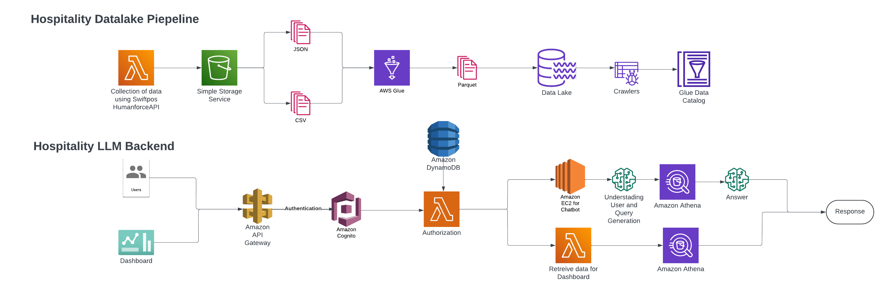

# Project Description

This project consists of four main components, each leveraging various AWS services to provide a comprehensive solution:

1. [ETL Data to Data Lake](#etl-data-to-data-lake)
2. [Dashboards APIs](#dashboards-apis)
3. [AI Chat](#ai-chat)
4. [User Management](#user-management)

## ETL Data to Data Lake

This section of the project focuses on automating the Extract, Transform, and Load (ETL) process, which collects data from various sources, transforms it into a standardized format, and stores it in a centralized data lake.

### Prerequisites
- AWS Lambda
- AWS Glue
- Amazon S3
- Amazon EventBridge

### Steps

1. **Upload Lambda Functions**:
   - Create the necessary AWS Lambda functions to perform the ETL tasks.
      - hospitality-chatbot-function
      - hospitality-chatbot-time-roster-func
   - Ensure that the Lambda functions are configured with the appropriate execution role and environment variables.

2. **Configure Glue Scripts**:
   - Create the Glue scripts that define the transformation logic for the data. consider `./ETL/glue-scripts`
   - Ensure that the Glue scripts are able to access the necessary data sources and target locations.

3. **Configure Glue Database**:
   - Create a Glue database to store the metadata for the transformed data.
   - Ensure that the database is configured with the appropriate permissions and access controls.

4. **Create Glue Crawlers**:
   - Set up Glue crawlers to automatically discover and catalog the data in the S3 data lake.
      - hospitality-chatbot-aristocrat-crawler
      - hospitality-chatbot-rosters-crawler
      - hospitality-chatbot-timesheets-crawler
      - hospitality-chatbot-crawler-test-2 (rename it)
   - Configure the crawlers to populate the Glue Data Catalog with the relevant metadata.

5. **Configure EventBridge**:
   - Create EventBridge rules to trigger the ETL process on a regular schedule or in response to specific events.
      - hospitality-chatbot-function (every 15 mins)
      - hospitality-chatbot-time-roster-func (every day)
   - Ensure that the EventBridge rules are configured to execute the appropriate Lambda functions.

6. **Upload the `prev_time_record` Folder**:
   - Ensure that the `prev_time_record` folder, containing the current time record, is uploaded to the appropriate location.
   - This folder is used to track the last successful run of the ETL process.

Remember to thoroughly test the ETL process and ensure that the data is being transformed and loaded into the data lake correctly. If you encounter any issues, refer to the AWS documentation or reach out to the project team for assistance.

## Dashboards APIs

This component of the project focuses on providing APIs that power the dashboard and visualization features of the application.

### Prerequisites
- AWS API Gateway
- AWS Lambda
- AWS Cognito
- AWS Athena

### Implementation Details

1. **API Gateway**: (consider `./APIGateway` folder)
   
   The APIs are built using AWS API Gateway, which acts as the entry point for the dashboard data.
   API Gateway handles the incoming requests and routes them to the appropriate backend services.
    -   Open the API Gateway console in the destination account or Region.

    - Choose Create API.

    -    Under REST API, for Choose an API type, choose Import.

    -    Under Import from  Open API 3, do either of the following:
    Paste your updated OpenAPI definition into the text editor field.

    -    Under Settings, for Endpoint Type, choose one of the following based on your use case:
    Regional
    Edge optimized
    Private

    -    Choose Fail on warnings to stop importing if there's an error or warning during import. Or, choose Ignore warnings to import the API whether there's an error or warning during import or not.

2. **Lambda Functions**:
   - AWS Lambda functions are used to implement the business logic and data processing for the dashboard APIs.

3. **API Authorizer**:
   - To secure the dashboard APIs, an API Authorizer, which includes AWS Cognito and a custom solution, is used to authenticate and authorize access to the APIs.

4. **Athena Integration**:
   - The data powering the dashboards is retrieved from the data lake using AWS Athena, an interactive query service that allows you to analyze the data stored in S3 using standard SQL queries.

## AI Chat

This part of the system focuses on providing an AI-powered chat functionality for users.

### Prerequisites
- AWS API Gateway
- Amazon EC2
- AWS Cognito
- AWS Athena
- OpenAI GPT-4

### Implementation Details

1. **API Gateway**:
   - AWS API Gateway is used as the entry point for the AI chat APIs, managing the incoming requests and routing them to the appropriate backend services.

2. **EC2 Instances**:
   - Amazon EC2 instances may be used to host the AI chat application and the necessary infrastructure to support it.

3. **Athena Integration**:
   - To enhance the AI chat functionality, data from the S3 data lake may be queried and analyzed using AWS Athena, providing the AI model with relevant information to improve its responses.

4. **OpenAI GPT-4**:
   - The core of the AI chat is powered by the OpenAI GPT-4 model, which handles the natural language processing and generation tasks.

## User Management

This component is responsible for managing user accounts and user-related data.

### Prerequisites
- Amazon DynamoDB
- AWS API Gateway
- AWS Cognito

### Implementation Details

1. **DynamoDB**:
   - Amazon DynamoDB, a NoSQL database, is used to store user information and user account details.

2. **API Gateway**:
   - AWS API Gateway provides the interface for creating, updating, and managing user accounts through various user management APIs.

3. **Cognito**:
   - AWS Cognito is the user authentication and authorization service, handling tasks such as user sign-up, sign-in, and access control.

Please ensure that all the necessary AWS resources are configured and integrated correctly to support the Dashboards APIs, AI Chat, and User Management components of the project.